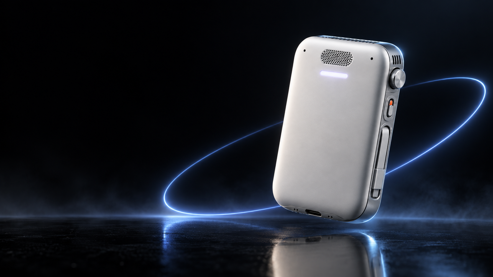

# MOB · Your AI. Its own computer.

A personal AI computer in development. Local model, speech, memory, browser and command tools in a pocket device, controlled by voice and an iPhone app. Work with the computers and programs you approve.

[Explore the interactive website](https://mob-agent-network.vabbyshabbyy.chatgpt.site) · [Launch page](https://vaibhavjnf.github.io/mob-launch/) · [Investor pitch](docs/downloads/MOB-Investor-Pitch.pdf) · [Supplier RFI](docs/downloads/MOB-Supplier-Brief.pdf)

## What we want MOB to do

- Research choices using current sources and selected context.
- Run a scoped command on an enrolled computer through a supported adapter.
- Prepare editable work from approved files; external sending needs separate approval.
- Explore Bluetooth call assistance after routing, duplex audio, echo control and takeover work on real devices.

Voice begins the task. The iPhone supplies setup, permissions and review. The intended local model and tools live on MOB. Web and remote-device work need Wi-Fi or a phone hotspot. Tailscale provides networking; it does not grant application access.

## Status

Concept and feasibility. Early software packages, a component shortlist and this public launch experience exist. There is no validated integrated hardware prototype, measured battery result, proven customer demand, manufacturing partnership or investor commitment.

Twelve-hour mixed use and a 112 × 72 × 26 mm enclosure are targets. Component fit, thermal behavior and the production bill of materials remain open. USB-C is primary power; magnetic mounting and wireless charging are under evaluation. No MagSafe or Qi2 certification is claimed. Retail price and shipping dates are uncommitted. Kickstarter is not live.

## Design and proof

The [interactive site](https://mob-agent-network.vabbyshabbyy.chatgpt.site) uses a deferred Three.js scene with image planes, particles and orbit geometry, plus static fallback, motion pause and reduced-motion behavior. It is a product narrative, not a dimensional model or a live agent demo. The eight-frame voice sprite has real alpha transparency. Product and interior images are explicitly labelled concept art.

The investor deck contains 18 slides, source-linked engineering assumptions and a proposed $750k pre-seed planning envelope. It presents the case to investigate, not measured results. [Engineering details](https://mob-agent-network.vabbyshabbyy.chatgpt.site/engineering) · [Roadmap](ROADMAP.md) · [Brand](BRAND.md) · [Campaign blueprint](CAMPAIGN.md).

## Participate

[Follow the build or discuss a partnership](https://mob-agent-network.vabbyshabbyy.chatgpt.site/#join). Updates are free; no deposit or delivery commitment. Contact Vaibhav Sharma, Kota, India: [vaibhavs362@gmail.com](mailto:vaibhavs362@gmail.com).

Updated 11 September 2026. Public graphics and PDFs are in `docs/`. This repository is the launch package; it does not contain an integrated hardware implementation.
