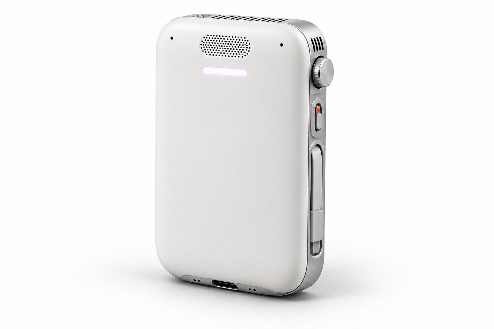
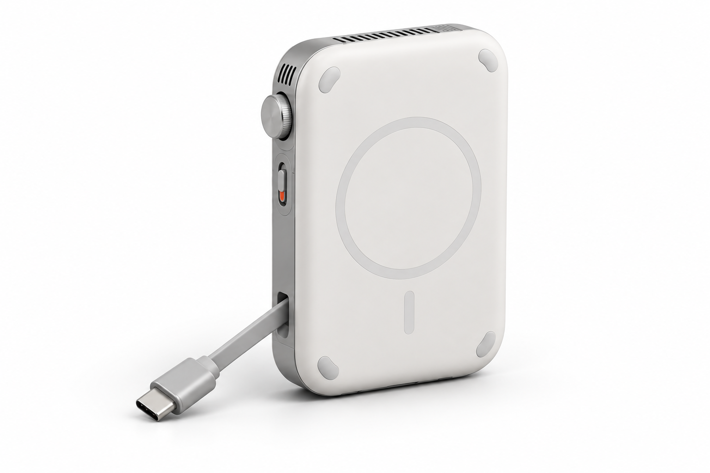
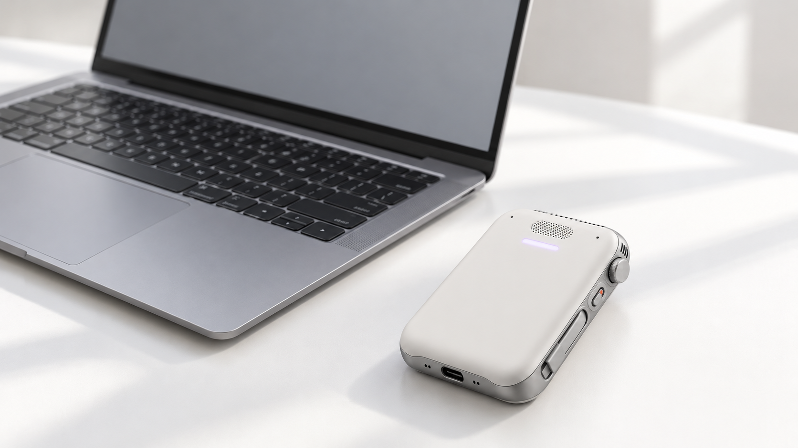

# MOB
### Your world, within reach.

A personal AI computer in development. Its language model, speech, browser, command runner and agent harness are intended to run **inside the device**. Voice and an iOS companion connect the experience; approved devices extend its reach over Tailscale.

[Visit MOB](https://mob-agent-network.vabbyshabbyy.chatgpt.site) · [Join the early list](https://mob-agent-network.vabbyshabbyy.chatgpt.site/?utm_source=github#join) · [Investor pitch](docs/downloads/MOB-Investor-Pitch.pdf) · [Supplier brief](docs/downloads/MOB-Supplier-Brief.pdf)

*Industrial design concept. No integrated hardware prototype has been validated.*

## The product

- **Local brain.** A Linux mini-computer running a small quantized model, local speech, memory and a scoped agent harness.
- **Natural control.** Voice first; an iOS app planned for enrollment, approvals and task receipts.
- **Connected reach.** Wi-Fi/hotspot for web access. Tailscale plus authorized SSH, APIs or companion adapters for enrolled devices.
- **Considered hardware.** A physical microphone cutoff, protected crown, status light, magnetic back and serviceable stowed USB-C lead.
- **Call assistance.** A Bluetooth HFP bridge is proposed. Duplex audio, iPhone routing, echo control and human takeover remain to be proven.

## Engineering baseline

| Item | Published part dimension or explicit target |
|---|---|
| Enclosure | 112 × 72 × 26 mm **target**, not validated fit |
| Compute | Lantronix Open-Q 8550CS, 16 GB / 128 GB option; 54 × 45 × 3.61 mm |
| Bluetooth call candidate | Microchip BM83; 32 × 15 × 2.5 mm |
| Microphones | 2 × Infineon IM69D128S; 3.5 × 2.65 × 1 mm each |
| Speaker reference | Adafruit 3923; 30 × 20 × 5 mm |
| Battery | Custom 7,000 mAh / 3.7 V target; 90 × 60 × 12 mm allocation, vendor not selected |
| Charging | USB-C primary; magnetic mounting and Qi receiver under evaluation |

**Power math, not a benchmark:** 25.9 Wh nominal × 85% assumed usable = 22.0 Wh. Twelve hours requires ≤1.83 W average. Continuous 6 W implies about 3.7 hours. Half a day is a mixed-use development target, not continuous LLM runtime. No MagSafe or Qi2 certification is claimed.

[Sources and engineering detail](https://mob-agent-network.vabbyshabbyy.chatgpt.site/engineering)

*Concept only. Mechanical stack-up, thermal design and component placement are open.*

## Status and roadmap

Today: concept design, component shortlist, early software source packages and feasibility planning. There is no validated integrated hardware prototype, measured battery result, announced manufacturing partner, claimed traction or investor commitment.

1. **Feasibility:** vendor quotes, BSP/model path, battery drawing, mechanical allocation.
2. **Bench proof:** local voice-to-action loop, Bluetooth audio, power and thermal measurements.
3. **EVT:** carrier, enclosure, 10–25 planning units, pre-compliance and fixtures.
4. **Pilot:** proposed 20 users over 30 days; publish measured task quality and runtime.
5. **Crowdfunding readiness:** working prototype footage, costed production, eligible creator entity and banking.
6. **DVT/PVT:** validation, certification, manufacturing quality and release review.

[Public roadmap](ROADMAP.md) · [Open engineering issues](https://github.com/vaibhavjnf/mob-launch/issues)

## Build with us

**Hardware partners:** read the [four-page RFI](docs/downloads/MOB-Supplier-Brief.pdf). We seek compute/BSP, audio, electronics, mechanical/thermal, battery and assembly expertise. Planning quote volumes are 25 / 100 / 1,000 / 5,000; these are not orders.

**Investors:** the [12-slide pitch](docs/downloads/MOB-Investor-Pitch.pdf) explains the thesis, validation milestones and an illustrative funding envelope. No round terms or shipping dates are fixed.

**Early users:** [join the list](https://mob-agent-network.vabbyshabbyy.chatgpt.site/?utm_source=github#join) and tell us the first task you would delegate. Signup creates no order or payment obligation.

## Kickstarter status

A campaign is **not live**. Kickstarter hardware rules require a working prototype and prohibit photorealistic renderings. These concept images belong to prelaunch and investor materials. India is not currently a supported creator country; a legitimate eligible entity and verified banking arrangements are an open dependency. [Read the campaign plan](CAMPAIGN.md).

## About this repository

This repository contains the public launch page, graphics, pitch, supplier brief and roadmap. It is not firmware or a complete working hardware release. The live signup service stores inquiries privately; contact data and private outreach logs are not in this repository.

Founder: **Vaibhav Sharma**, Kota, India · [Email](mailto:vaibhavs362@gmail.com)

© 2026 MOB. Brand, graphics and pitch materials are reserved for MOB; no trademark registration is claimed. Source examples are supplied for review; no open-source hardware license is asserted.
